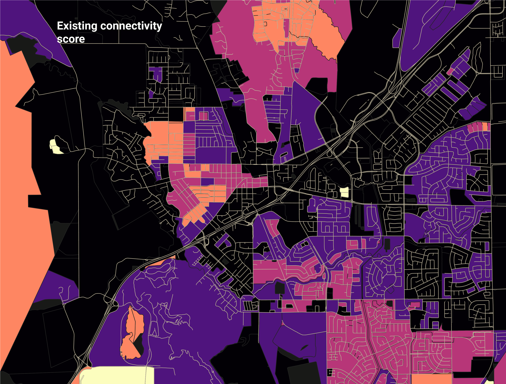

# pyBNA

## Introduction

Python module to implement BNA logic on a PostGIS database. Uses a configuration
file for customizability. The current implementation requires a user to run the
old-style BNA on the command line to import datasets. This library can build the
routeable network, process the connectivity routing, and calculate scores.

Bicycle Network Analysis (BNA) is a way to measure how effectively people
can connect to destinations via bike on comfortable, "low-stress" routes.
More info on the methodology at the [What is the BNA?](what_is_bna.md) page.



## Requirements

pyBNA is tested with Python 3.6. The following libraries are required:
- psycopg2
- tqdm
- pyyaml
- geopandas
- munch
- overpass
- osmnx
- xlrd

A requirements.txt file is provided for convenience. You can install these via
pip:
```
pip install -r requirements.txt
```

_*Special note for Windows users:_ Installing geopandas can be a real pain. If
you don't already have a working version of Geopandas, we suggest following
[this excellent guide](https://geoffboeing.com/2014/09/using-geopandas-windows/)
from Geoff Boeing.

The `osmium` package is also required for parsing OSM destinations from an .osm
extract, but if you're downloading destinations directly from OSM you can
safely skip this dependency.

## tl;dr (Simple run)

The most simple BNA run, using stock datasets and no customization, can be
completed in a few easy steps. The following assumes you already have a database
running named "bna" on the local machine.

```
import pybna

# imports
i = pybna.Importer()
i.import_boundary('/path/to/your/boundary/file')
i.import_census_blocks(fips=16)
i.import_census_jobs("received.neighborhood_census_block_jobs",state="ID")
i.import_osm_network()
i.import_osm_destinations()

# stress
s = pybna.Stress()
s.segment_stress()
s.crossing_stress()

# connectivity
bna = pybna.pyBNA()
bna.calculate_connectivity()

# scores
bna.score("myschema.my_scores_table")
bna.aggregate("myschema.my_aggregate_score_table")
```

## Importing data

pyBNA includes a workflow to import data from publicly available sources (for
the United States, at least). Automatic import of demographic data relies on US
Census 2010 data. Street network and bicycle facility data is imported from
OpenStreetMap.

For more guidance on the import process, see our [import instructions](import.md).

## Traffic Stress

pyBNA has a module that can calculate traffic stress based on roadway
characteristics in your roadway data. There's also the ability to apply
assumptions for locations where data is not available.

For more information about the traffic stress module, see the [traffic stress
instructions](stress.md).

## Getting started

First, import pybna and create a pyBNA object by pointing it to the config file.
```
import pybna
bna = pybna.pyBNA(config="/path/to/my/config.yaml")
```

Next, you can calculate the connectivity with
```
bna.calculate_connectivity()
```

Lastly, you can generate block-level scores with
```
bna.score("myschema.my_scores_table")
```

and aggregate scores for the entire study area with
```
bna.aggregate("myschema.my_aggregate_score_table")
```

## Configuration file

Most options in pyBNA are managed using a configuration file. This file is
passed as an argument when creating the pyBNA object and tells pyBNA important
things about your data and the assumptions you want to make in the analysis. The configuration file is written using [YAML](http://yaml.org/start.html).

There's more information about the configuration file [here](config.md)

## Travel sheds

Once you've completed the connectivity analysis, you can develop a low/high stress travel shed for any census block with
```
bna.travel_sheds([list, of, block, ids, here], my_travel_shed_table)
```

## Scenarios

pyBNA includes the capability to run scenarios as a way to visualize the connectivity impacts of a project or group of projects. More information on scenarios is available [here](scenarios.md).
